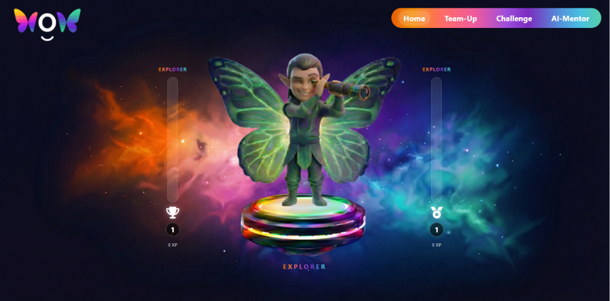
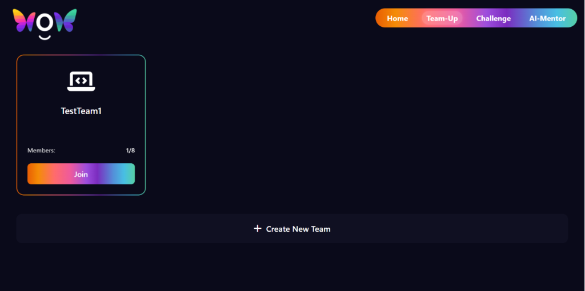
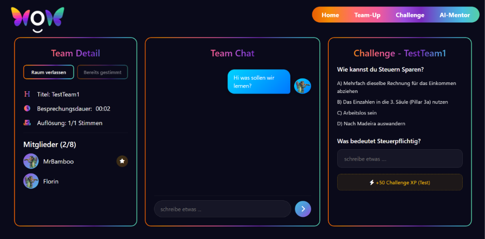
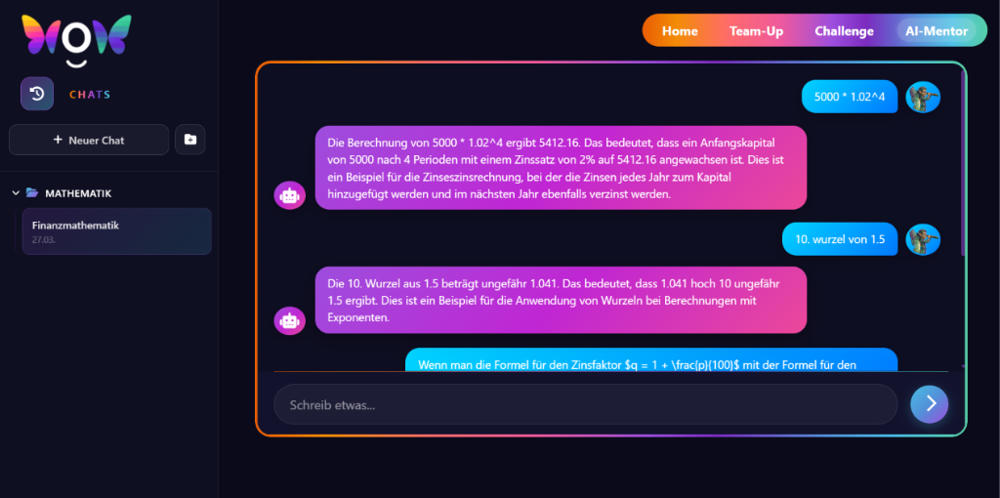
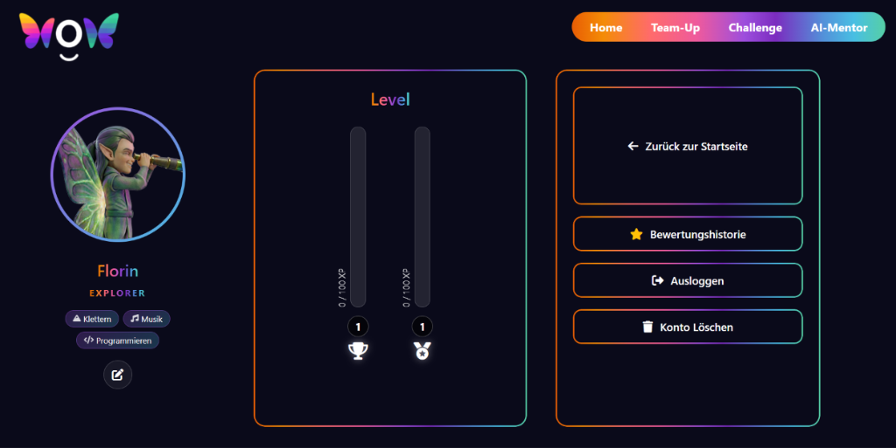

# WOW - DialogApp �

Eine Plattform für Lernen durch Dialog. Hier steht der Austausch im Mittelpunkt – sei es mit anderen Lernenden in Teams oder mit dem AI-Coach. Das Wissen entsteht nicht durch Pauken, sondern durch Kommunikation.



## 💡 Philosophie

Lernen passiert am besten im Gespräch. WOW fördert diesen Austausch:

- **Miteinander reden:** In Team-Rooms diskutieren und voneinander lernen.
- **Mit KI reflektieren:** Der AI-Coach ist dein Dialogpartner, der dir hilft, Themen zu durchdringen.
- **Wachsen durch Austausch:** XP gibt es nicht nur für Aufgaben, sondern vor allem für wertvolle Beiträge im Dialog.

## ✨ Features

- **Dialog-Teams �️**: Live-Chat Räume, in denen Diskussionen und Zusammenarbeit im Vordergrund stehen.
- **AI Dialog-Partner 🤖**: Ein intelligenter Coach (OpenRouter), der dich in tiefgehende Gespräche verwickelt, statt nur Antworten zu liefern.
- **Avatar Entwicklung 🧝**: Dein Elf wächst mit der Qualität deiner Interaktionen (Explorer -> Designer -> Master).
- **XP durch Kommunikation 📊**:
  - **Challenge XP**: Für das aktive Einbringen in Diskussionen.
  - **Mentor XP**: Für das Erklären und Helfen im Dialog.
- **Sicherer Austausch 🔐**: Verifizierte Accounts (Email-Code) für eine vertrauensvolle Umgebung.

## 📸 Screenshots

Hier sind einige Eindrücke aus der WOW App:

### 1. Home-Bereich (Startseite)


### 2. Team-Up Übersicht


### 3. Team-Chat & Challenges


### 4. AI-Mentor (Dialogpartner)


### 5. Avatar & Levelentwicklung (Profil)



## 🛠️ Tech Stack

- **Frontend**:
  - HTML5 & Vanilla CSS (Custom Design, responsive Layouts)
  - Vanilla JavaScript (ES6 Modules, clientseitiger Router, State Management)
  - Custom UI (Fokus auf Lesbarkeit und Ästhetik)
- **Backend**:
  - Node.js & Express
  - REST API für Echtzeit-nahe Kommunikation
- **Datenbank**:
  - MongoDB Atlas (Cloud)
- **Services**:
  - Nodemailer (Verifizierung)
  - OpenRouter API (AI-Dialog)

## 🚀 Installation & Start

### Voraussetzungen

- Node.js & npm installiert
- MongoDB Atlas Connection String
- SMTP Server Zugangsdaten

### 1. Projekt klonen

```bash
git clone <repository-url>
cd lern-app
```

### 2. Backend starten (Kommunikations-Server)

```bash
cd backend
npm install
```

Erstelle eine `.env` Datei im `backend` Ordner:

```env
PORT=3000
MONGODB_URI=mongodb+srv://...
JWT_SECRET=dein_secret
SMTP_HOST=...
SMTP_PORT=465
SMTP_USER=...
SMTP_PASS='...'
```

```bash
npm run dev
```

### 3. App starten

Da das Backend die statischen Frontend-Dateien direkt ausliefert, musst du das Frontend nicht separat starten. 

Sobald der Backend-Server läuft (siehe Schritt 2), kannst du die App im Browser aufrufen:
- **URL**: `http://localhost:3000` (oder den in der `.env` konfigurierten Port)

## 📂 Struktur

- `index.html`: Haupt-HTML-Datei und Einstiegspunkt der Anwendung.
- `js/`: Clientseitige Logik (Router, Pages, Komponenten und Services).
- `css/`: Custom Styling der Benutzeroberfläche.
- `assets/`: App-Ressourcen (Bilder, Icons, Favicon).
- `backend/`: Node.js Express Server, Routen und MongoDB Mongoose-Modelle.

## 🤝 Mitwirken

Wir freuen uns über Pull Requests, die den Austausch auf der Plattform weiter fördern!
